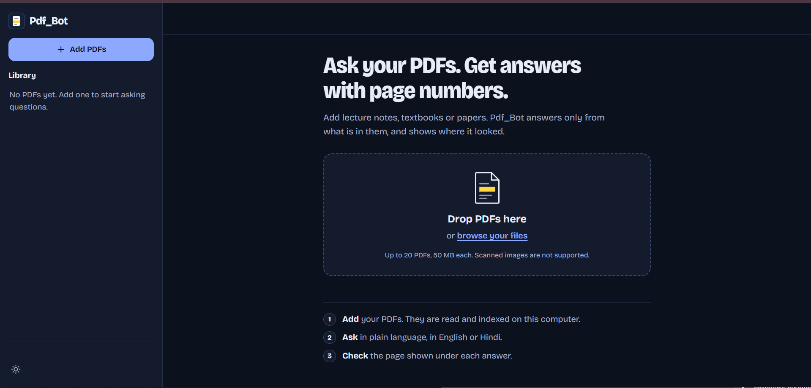
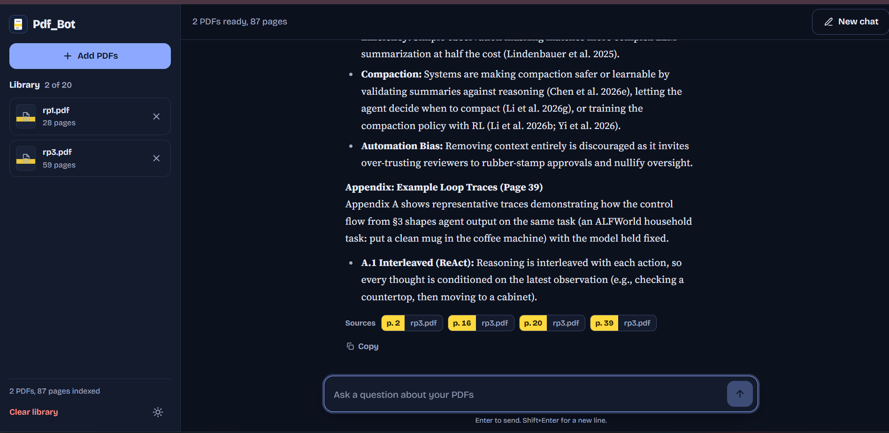
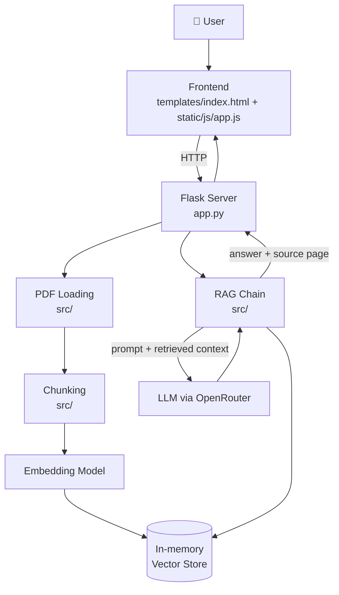

<div align="center">

# 📄 AskMyPDF AI

**Upload your PDFs. Ask questions. Get answers grounded in your documents, with the page cited.**

[](https://www.python.org/)
[](https://flask.palletsprojects.com/)
[](https://openrouter.ai/)
[](#-how-it-works)

[📦 Repository](https://github.com/ajya97/AskMyPDF_AI) · [🐛 Report a Bug](https://github.com/ajya97/AskMyPDF_AI/issues)

</div>

---

## 📖 Overview

**AskMyPDF AI** is a Flask web application for question answering over your own PDF documents such as lecture notes, textbooks, and research papers. You upload PDFs into a library, then ask questions in a chat interface. Answers are generated **only from the content of your PDFs**, and **every answer shows the page it used**, so you can check it against the source.

The project uses a Retrieval-Augmented Generation (RAG) approach. Documents are loaded and split into chunks, embedded, and stored in a vector store. Relevant chunks are retrieved for each question and passed to an LLM accessed through OpenRouter.

---

## ✨ Features

| Feature | Description |
|---|---|
| 📚 **PDF Library** | Upload multiple PDFs (notes, textbooks, papers) into a library shown alongside the chat. |
| 💬 **Chat Interface** | Ask natural-language questions in a single-page UI that combines library and chat. |
| 🎯 **Document-Grounded Answers** | Answers come only from your uploaded PDFs. |
| 📍 **Page Citations** | Every answer shows the page it used. |
| 🧠 **Semantic Retrieval** | PDFs are chunked and embedded with a locally downloaded embedding model (about 400 MB, fetched once). |
| 🔌 **Configurable Models** | The LLM and embedding model can be changed through `.env` (`LLM_MODEL`, `EMBEDDING_MODEL`). |

---

## 📸 Screenshots

> Screenshots have not been added yet. Replace the placeholders below with real captures of the app running locally.

| Library + Chat (Home) | Answer with Page Citation |
|---|---|
|  |  |

---

## 🧠 How It Works

```text
PDF Upload
    ↓
PDF Loading (selectable text)
    ↓
Chunking (page information retained)
    ↓
Embedding (embedding model)
    ↓
In-memory Vector Store
    ↓
User Question → Retrieval of relevant chunks
    ↓
LLM via OpenRouter (answers from retrieved context)
    ↓
Answer + Source Page shown in the chat UI
```

1. **Ingest:** uploaded PDFs are read, split into chunks, embedded, and indexed.
2. **Retrieve:** a question is matched against the indexed chunks.
3. **Generate:** the retrieved context is sent to the configured LLM through OpenRouter, so answers are limited to your documents.
4. **Cite:** the page used for the answer is displayed with it.

> The exact chunk size, retrieval parameters, and prompt design live in `src/` and are **Not specified** here.

---

## 🏗️ System Architecture



---

## 🛠️ Tech Stack

| Category | Technology |
|---|---|
| **Language** | Python 3.11 / 3.12 |
| **Backend** | Flask (`app.py`) |
| **Frontend** | HTML (`templates/index.html`), CSS (`static/css/style.css`), JavaScript (`static/js/app.js`) |
| **AI / RAG** | Embedding model (about 400 MB, downloaded on first use), vector store, RAG chain in `src/` |
| **LLM Provider** | OpenRouter (via `LLM_API_KEY`) |
| **Storage** | In-memory library (cleared on restart); upload directory at `data/uploads/` |
| **Specific libraries** | Not specified, see `requirements.txt` |

---

## 📂 Project Structure

```text
AskMyPDF_AI/
│
├── app.py              # Flask server and API
├── requirements.txt    # Python dependencies
├── .gitignore
├── README.md
│
├── src/                # PDF loading, chunking, vector store, RAG chain
├── templates/
│   └── index.html      # Single page: library + chat
├── static/
│   ├── css/style.css   # Styling
│   └── js/app.js       # Frontend logic
└── data/
    └── uploads/        # Upload directory
```

---

## ⚙️ Installation

**Prerequisite:** Python **3.11 or 3.12** (some AI libraries do not support newer versions yet).

```bash
git clone https://github.com/ajya97/AskMyPDF_AI.git
cd AskMyPDF_AI

python -m venv .venv
```

Activate the virtual environment:

```powershell
# Windows
.venv\Scripts\activate
```

```bash
# macOS / Linux
source .venv/bin/activate
```

Install dependencies:

```bash
pip install -r requirements.txt
```

---

## 🔐 Environment Variables

Create a `.env` file in the project root. If a `.env.example` template exists in your checkout, copy it to `.env` and fill in the values.

```env
LLM_API_KEY=your_openrouter_api_key

# Optional
LLM_MODEL=your_preferred_model
EMBEDDING_MODEL=your_preferred_embedding_model
HOST=127.0.0.1
PORT=5000
```

| Variable | Required | Purpose |
|---|---|---|
| `LLM_API_KEY` | ✅ | OpenRouter API key. A free key is available at [openrouter.ai/keys](https://openrouter.ai/keys). |
| `LLM_MODEL` | Optional | Choose the LLM used for answers. |
| `EMBEDDING_MODEL` | Optional | Choose the embedding model. |
| `HOST` | Optional | Server host. |
| `PORT` | Optional | Server port. |

> 🔒 Never commit your real API key. Keep `.env` out of version control.

---

## ▶️ Running Locally

```bash
python app.py
```

Then open **http://127.0.0.1:5000** in your browser.

> The first PDF takes longer because the embedding model (about 400 MB) is downloaded once.

---

## 🔌 API Documentation

`app.py` provides the Flask server and API used by the frontend. The specific routes, request formats, and response schemas are **Not specified** here because they have not been documented in the repository. Add an endpoint table here once the routes are confirmed from `app.py`.

---

## 🤖 Machine Learning Pipeline

This project uses pretrained models for retrieval and generation and does **not** include a model training pipeline.

```text
PDF → Text Extraction → Chunking → Embeddings → Vector Store
                                                     ↓
              Question → Retrieval → LLM (OpenRouter) → Answer + Page
```

| Stage | Notes |
|---|---|
| Text extraction | PDFs must contain selectable text. |
| Embeddings | Local embedding model, configurable with `EMBEDDING_MODEL`. |
| Generation | LLM accessed through OpenRouter, configurable with `LLM_MODEL`. |
| Dataset / training | Not applicable, no custom training is documented. |

---

## 📊 Model Performance

> Model performance metrics are not currently documented in the repository.

---

## ⚠️ Known Limitations

- PDFs must contain **selectable text**. Scanned or image-only PDFs need OCR first.
- The library lives **in memory**, so restarting the app clears it.
- The first PDF upload is slower because the embedding model is downloaded once.

---

## 🧪 Testing

No automated test suite is currently present in the repository. Manual testing flow:

1. Start the app with `python app.py`.
2. Upload a text-based PDF.
3. Ask a question that the PDF answers and check that the cited page matches the source.
4. Ask something the PDF does not cover and check the behavior.

---

## 🚀 Deployment

This project is **not currently deployed**. It is meant to be run locally by following the [Installation](#️-installation) and [Running Locally](#️-running-locally) steps above.

---

## 🔮 Future Improvements

*These are suggestions, not existing features.*

- 💾 Persist the library so documents survive restarts
- 🔎 OCR support for scanned PDFs
- ✅ Automated tests for the ingestion and retrieval pipeline
- 📈 Retrieval and answer-quality evaluation
- 🔐 Authentication and per-user libraries
- 🐳 Dockerfile and CI/CD workflow
- 🌐 Public deployment

---

## 🤝 Contributing

Contributions are welcome.

1. Fork the repository
2. Create a feature branch: `git checkout -b feature/your-feature`
3. Commit your changes: `git commit -m "Add your feature"`
4. Push the branch: `git push origin feature/your-feature`
5. Open a Pull Request describing your changes

---

## 📄 License

> No license has currently been specified for this project.

---

## 👨‍💻 Author

**Ajeet Yadav** ([@ajya97](https://github.com/ajya97))

- 🐙 GitHub: [github.com/ajya97](https://github.com/ajya97)
- 💼 LinkedIn: [linkedin.com/in/ajya97](https://www.linkedin.com/in/ajya97)

---

## ⭐ Support

If you find this project useful, please consider giving it a ⭐ on [GitHub](https://github.com/ajya97/AskMyPDF_AI) and sharing feedback through issues or pull requests.